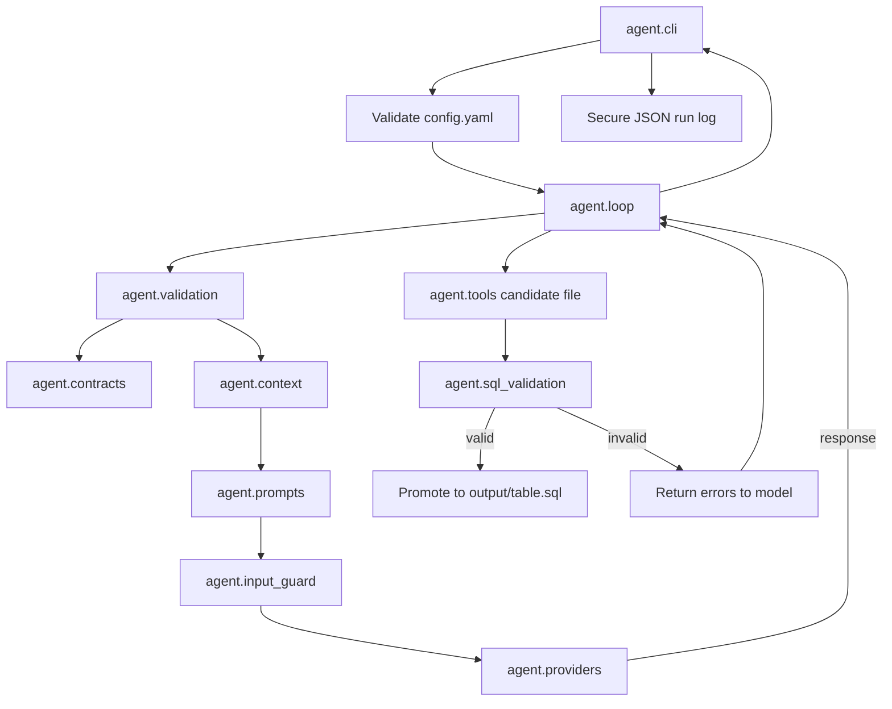

# CardiacAI OMOP Agent Technical Guide

## 1. Purpose and architecture

The project is a small, bounded code-generation agent. It converts three
validated specification types into one SQL model for one OMOP table:

```text
source schemas + OMOP target schema + field mappings
                         │
                         ▼
                 validated prompt context
                         │
                         ▼
                   model-generated SQL
                         │
                         ▼
                  static SQL validation
                         │
                         ▼
                 output/{table}.sql
```

The application, not the language model, controls:

- Which specifications are loaded.
- Which files may be read or written.
- The maximum number of API requests.
- Whether generated SQL is valid.
- Whether a candidate file is promoted to final output.
- How API usage is logged.

The model is responsible only for translating validated mapping instructions
into SQL.

## 2. End-to-end runtime flow



The practical sequence is:

1. `agent.cli` parses command-line options and validates `config.yaml`.
2. `agent.validation` loads and cross-checks the requested specifications.
3. `agent.context` converts the validated objects into compact model context.
4. `agent.prompts` combines fixed instructions with the untrusted
   specification context.
5. `agent.input_guard` rejects an unexpectedly large initial request.
6. `agent.providers` constructs the configured API provider.
7. `agent.loop` requests SQL through a bounded tool-calling loop.
8. `agent.tools` writes SQL to a run-specific candidate file.
9. `agent.sql_validation` validates the candidate deterministically.
10. A valid candidate atomically replaces `output/{table}.sql`.
11. `agent.cli` writes the transcript and measured token usage to `logs/`.

## 3. Module dependency overview

| Module | Main responsibility | Called by |
| --- | --- | --- |
| `agent.cli` | User entry point, preflight, cost guard and logging | User |
| `agent.contracts` | Pydantic contracts for configuration and YAML | Validation and CLI |
| `agent.validation` | File and in-memory cross-specification validation | CLI, API, context and loop |
| `agent.api` | Authenticated HTTP validation and preflight interface | UI or another server |
| `agent.preflight` | Shared readiness, prompt-size and token-ceiling calculation | CLI and API |
| `agent.context` | Prompt-ready representation of validated specs | CLI, API and loop |
| `agent.prompts` | Fixed model instructions and data boundaries | CLI and loop |
| `agent.input_guard` | Initial request-size protection | CLI and loop |
| `agent.providers.base` | Provider-neutral request/response contract | Provider and loop |
| `agent.providers` | Provider factory | Loop |
| `agent.providers.codex_provider` | OpenAI Responses API adapter | Provider factory |
| `agent.tools` | Restricted candidate-file operations | Loop |
| `agent.sql_validation` | Deterministic static SQL checks | Loop |
| `agent.loop` | Generate, validate, revise and optionally promote SQL | CLI and API |

## 4. `agent/cli.py`

### Purpose

`cli.py` is the application entry point:

```bash
python -m agent.cli person
```

It separates local operations from API-backed generation. Validation is the
default; an API call requires the explicit `--generate` option.

### Main responsibilities

- Parse the OMOP table and command-line options.
- Load `.env`.
- Load and validate `config.yaml`.
- Apply safe per-run configuration overrides.
- Calculate the worst-case output-token ceiling.
- Validate specifications and build context.
- Run validation-only and dry-run modes without creating a provider.
- Block generation when reviews or size checks fail.
- Run the agent loop.
- Write owner-only JSON logs.
- Return a non-zero process status when generation is unsuccessful.

### Important functions

#### `main()`

Coordinates the full command-line workflow. This is the only function invoked
when running `python -m agent.cli`.

Execution modes are mutually exclusive:

- Default or `--validate-only`: validate locally.
- `--dry-run`: validate and print preflight information.
- `--generate`: permit API-backed generation.

#### `_configured_output_token_ceiling(config, max_iterations)`

Calculates:

```text
max_output_tokens × max_iterations × (max_api_retries + 1)
```

Generation is refused unless the user supplies a
`--max-run-output-tokens` value at least this large.

#### `_api_error_message(error)`

Converts OpenAI SDK exceptions into concise messages. It deliberately avoids
printing raw exception text because raw request errors may contain sensitive
details.

#### `_format_usage(usage)`

Formats measured provider usage for the terminal. Cached input and reasoning
tokens are displayed as subsets rather than added again to the total.

#### `_positive_int(value)`

Provides a shared positive-integer parser for CLI limits.

#### `_json_default(obj)`

Allows dataclass instances in the run result to be serialized into JSON.

### Log handling

The CLI writes:

```text
logs/{omop_table}_{timestamp}.json
```

The file is created with mode `0600`, which permits access only by its owner.
The write uses exclusive creation so an existing log cannot be overwritten.

## 5. `agent/contracts.py`

### Purpose

`contracts.py` is the structural source of truth for configuration and
specification YAML. It uses Pydantic to reject malformed, incomplete and
unexpected input before the model is contacted.

### Shared base

#### `StrictModel`

Sets `extra="forbid"` for every contract. Misspelled or unsupported YAML
properties therefore fail validation instead of being silently ignored.

#### `SqlIdentifier`

Restricts relation and field identifiers to:

```text
[A-Za-z_][A-Za-z0-9_]*
```

This prevents path traversal, SQL punctuation and arbitrary expressions from
being supplied where an identifier is expected.

### Configuration contracts

#### `SourceConfig`

Defines how generated SQL refers to sources:

- `relation`
- `dbt_ref`
- `dbt_source`

Its validator requires `source_name` when `dbt_source` is selected.

#### `OutputConfig`

Defines:

- Output format: `sql` or `dbt`.
- SQL dialect: `snowflake`, `postgres`, `athena` or `bigquery`.

#### `AgentConfig`

Validates the root `config.yaml`, including provider, model and cost controls.
Its compatibility validator prevents plain SQL from using dbt-only reference
styles.

### Source-schema contracts

#### `SourceColumn`

Represents one source field:

- Name.
- Optional datatype.
- Description.
- Primary-key marker.

#### `SourceModel`

Represents one source table or dbt model and its columns.

#### `SourceSchemaDocument`

Represents the root of one source-schema YAML file.

### Mapping contracts

#### `SourceFieldReference`

Identifies one field using a source model name and field name.

#### `SourceJoin`

Defines one `inner` or `left` equality join between source fields.

#### `FieldMapping`

Defines how one OMOP target field is produced:

- `target_field`
- `action`
- `source_fields`
- `transformation`
- Optional `mapping_table_name`
- Optional review gate

`validate_action()` enforces:

- `map` has exactly one source field.
- `null` and `skip` have no source fields.
- `null` and `skip` cannot use a mapping table.
- A mapping table requires at least one source field.
- Required reviews include both a comment and status.
- Review status is not allowed unless review is required.

`normalize_blank_mapping_table_name()` treats whitespace-only values as null.

#### `MappingDocument`

Represents one complete source-to-OMOP mapping.

`validate_references()`:

- Invents `mapping_{target_table}_{target_field}` when the
  `mapping_table_name` property is explicitly blank or null.
- Rejects duplicate source models.
- Rejects duplicate target fields.
- Rejects field or join references to undeclared source models.

The distinction between an omitted and a null mapping-table property is
intentional:

- Omitted: the target does not require a mapping table.
- Blank/null: a mapping table is required and its name is generated.

### Target-schema contracts

#### `TargetForeignKey`

Defines a referenced OMOP table and field, plus optional vocabulary domain and
concept class.

#### `TargetField`

Defines an OMOP output field, including datatype, requirement, key information,
description and ETL convention.

#### `TargetSchemaDocument`

Represents one OMOP target table, including its CDM schema, required flag,
completeness metadata, table guidance and ordered fields. Its validator rejects
duplicate fields and optional primary keys.

## 6. `agent/validation.py`

### Purpose

Pydantic validates individual documents. `validation.py` then validates the
relationships between those documents.

### Core result type

#### `ValidatedSpecs`

A frozen dataclass containing:

- The validated `MappingDocument`.
- Referenced source models indexed by name.
- The validated `TargetSchemaDocument`.

Downstream modules consume this object rather than reading raw YAML again.

### Public functions

#### `validate_specs(omop_table, specs_dir)`

This is the main specification-validation entry point.

It:

1. Validates the CLI table identifier.
2. Loads `specs/mappings/{omop_table}.yml`.
3. Loads `specs/target_schema/{omop_table}.yml`.
4. Reads the mapping's `source_models`.
5. Loads each `specs/source_schema/{source_model}.yml`.
6. Confirms every source field exists.
7. Confirms every mapped target exists.
8. Confirms every required target is represented in the mapping.

An explicit `action: "null"` satisfies required-field coverage because it
records a deliberate user decision.

#### `validate_spec_contents(...)`

Validates in-memory source-schema and mapping content using the same contracts
and cross-file rules. The HTTP API uses this function while the CLI continues
to use `validate_specs()`.

#### `pending_review_fields(specs)`

Returns target fields whose review status is `pending`. Both CLI generation and
direct loop use rely on this check.

### Internal loaders

- `_load_yaml()` reads YAML and provides path-aware errors.
- `_load_mapping()` validates the mapping and table-name agreement.
- `_load_source_model()` enforces one-file-per-model naming.
- `_load_target_schema()` validates the target and table-name agreement.

### Error type

#### `SpecValidationError`

Wraps specification failures in a domain-specific exception suitable for
display by the CLI.

## 6A. `agent/api.py`

### Purpose

Provides an optional versioned HTTP boundary for validation, generation
preflight and bounded SQL generation. It is separate from `agent.cli`.
Validation and preflight never create a provider or make an OpenAI request;
only the explicitly confirmed generation endpoint may do so.

### Endpoints

- `GET /health` provides unauthenticated liveness.
- `POST /v1/validate` accepts source-schema and mapping YAML, loads the
  agent-owned target schema and returns validation and review readiness.
- `POST /v1/preflight` performs the same validation, then uses the agent-owned
  config and prompts to report prompt size, SQL settings, attempt limits and
  the worst-case output-token ceiling.
- `POST /v1/generate` requires exact confirmation of the current token
  ceiling, runs one bounded generation and returns only validated SQL plus
  measured usage. It does not return the internal transcript or overwrite the
  CLI output file.

Validation requests require a bearer token matching `AGENT_API_TOKEN`.
Request documents and total request content have bounded sizes. Error
responses omit submitted values. API generation is limited to one concurrent
request per server process and a maximum configured ceiling of 20,000 output
tokens.

### Project-scoped generation settings

Preflight and generation requests may include these safe SQL-output choices:

- SQL dialect.
- Output format.
- Source reference style.
- dbt source name, when `dbt_source` is selected.

The API validates compatibility before applying them to that request. It does
not allow clients to override the provider, model, prompt limits, output-token
limits, attempt count or retry policy. Those controls remain agent-owned in
`config.yaml`, so the UI cannot weaken cost and safety limits.

## 6B. `agent/preflight.py`

### Purpose

Calculates deterministic generation readiness for both the CLI and HTTP API.
It builds the real generation prompts and cost ceiling without constructing a
provider or making an OpenAI request.

### Functions

- `build_generation_preflight()` reports review blockers, prompt size and the
  output-token ceiling for validated specifications.
- `configured_output_token_ceiling()` applies the configured per-request
  output limit, generation attempts and API retry count.

## 7. `agent/context.py`

### Purpose

`context.py` transforms validated Pydantic objects into a compact,
human-readable specification block for the model.

It does not pass raw YAML to the provider.

### Functions

#### `build_context(omop_table, specs_dir)`

Revalidates the specifications and builds the complete context containing:

- Referenced source models and columns.
- Target CDM version.
- Declared source joins.
- Every target field in target-schema order.
- Target datatypes and constraints.
- Mapping action, sources and transformation.
- Mapping-table conventions.
- Review state and comment.
- Automatic null behaviour for unmapped optional fields.

#### `build_context_from_specs(specs)`

Builds the same context from already validated in-memory specifications. The
HTTP preflight uses this path so uploaded YAML is not written to disk.

#### `_format_source_model(model)`

Formats a source model, its description and columns.

#### `_format_target_field(target, mapping)`

Combines a target field with its mapping. When there is no mapping, it
explicitly tells the model to emit `NULL`.

For mapping-table fields, it documents:

- The resolved logical relation name.
- Same-named lookup columns.
- The target result column.

## 8. `agent/prompts.py`

### Purpose

`prompts.py` keeps stable behavioural instructions separate from specification
data.

### Functions

#### `build_system_prompt(omop_table, config)`

Defines non-negotiable generation rules:

- Exact output filename.
- SQL dialect and format.
- Source reference syntax.
- One `SELECT` statement.
- Target-schema field order.
- Typed null handling.
- Mapping-table join convention.
- Allowed identifiers and files.

It also tells the model to treat specification descriptions and comments as
untrusted data.

#### `build_user_prompt(context, output_filename)`

Wraps context inside:

```text
<UNTRUSTED_SPECIFICATION_DATA>
...
</UNTRUSTED_SPECIFICATION_DATA>
```

Any closing marker contained in specification text is escaped so the data
cannot terminate its own boundary.

#### `_source_reference_instruction(source)`

Builds the correct relation, `ref()` or `source()` instruction from
configuration.

## 9. `agent/input_guard.py`

### Purpose

The input guard prevents unexpectedly large initial prompts from reaching the
API.

### Functions

#### `initial_request_character_count(system_prompt, user_prompt, tools)`

Serializes the initial instructions, user message and tool schemas in a stable
form, then returns the character count.

#### `enforce_initial_request_limit(...)`

Raises `InputSizeLimitError` when the count exceeds
`max_initial_prompt_characters`.

### Design limitation

This is a deterministic character-based guard, not a model tokenizer. It
protects against accidental prompt growth but is not an exact input-token or
cost estimate.

## 10. `agent/providers/base.py`

### Purpose

Defines a provider-neutral boundary so the loop does not depend on a vendor's
response format.

### Types

#### `ToolCall`

Normalized model tool request:

- Call ID.
- Tool name.
- Parsed argument dictionary.

#### `TokenUsage`

Normalized usage counters:

- Input tokens.
- Cached input tokens.
- Cache-write input tokens.
- Output tokens.
- Reasoning output tokens.
- Total tokens.

Its `__add__()` implementation aggregates multiple successful responses.

#### `ProviderResponse`

Normalized model response containing:

- Optional assistant text.
- Tool calls.
- Stop reason.
- Token usage.

#### `AgentProvider`

Abstract interface requiring:

```python
complete(system, messages, tools) -> ProviderResponse
```

A future provider must implement this contract.

## 11. `agent/providers/__init__.py`

### Purpose

Provides the provider factory.

#### `load_provider(config)`

Currently constructs `CodexProvider` using:

- Configured model.
- `OPENAI_API_KEY`.
- Per-request output limit.
- SDK retry limit.

The configuration contract currently permits only `provider: codex`.

## 12. `agent/providers/codex_provider.py`

### Purpose

Adapts the provider-neutral contract to the OpenAI Responses API.

### State

`CodexProvider` retains:

- `_previous_response_id`
- `_consumed_message_count`

This allows later iterations to use server-side conversation state without
resending assistant turns already represented by `previous_response_id`.

### Main methods

#### `__init__(...)`

Validates limits and creates the OpenAI client with:

- Configured API key.
- Configured retry count.
- A 120-second timeout.

#### `complete(system, messages, tools)`

1. Converts canonical tools to Responses API tools.
2. Converts only new canonical messages to native input.
3. Applies `max_output_tokens`.
4. Disables parallel tool calls.
5. Sends the request.
6. Parses function-call arguments.
7. Saves conversation state after a successful response.
8. Returns a normalized `ProviderResponse`.

#### `_to_openai_tools(tools)`

Converts internal tool schemas into strict Responses API function tools.

#### `_to_openai_input(messages)`

Converts user, assistant and tool messages to native Responses API items.
Tool results preserve the original tool-call ID.

#### `_parse_arguments(raw_arguments, tool_name)`

Parses tool arguments as JSON and requires an object.

#### `_normalize_usage(usage)`

Maps the API usage object into `TokenUsage`, including cached and reasoning
subsets.

### Failure behaviour

OpenAI SDK errors propagate to the CLI, where known API failures receive
sanitized messages. Malformed function-call JSON currently raises a parsing
exception directly; it is not treated as a retryable model response.

## 13. `agent/tools.py`

### Purpose

Provides the only operations the model may request. It does not expose an
arbitrary shell or unrestricted filesystem.

### File boundary

The tool layer permits only top-level `.sql` files under:

```text
output/
```

The filename and candidate ID are validated with allow-list regular
expressions. Nested paths and traversal are rejected.

### Functions

#### `read_file(path, candidate_id=None)`

Reads the run-specific candidate when present; otherwise reads the promoted
file.

#### `write_file(path, content, candidate_id=None)`

Writes non-empty SQL into a hidden run-specific candidate:

```text
output/.{table}.{candidate_id}.candidate
```

It does not modify the final output.

#### `promote_file(path, candidate_id=None)`

Atomically replaces the final SQL file with a validated candidate.

#### `discard_candidate(path, candidate_id=None)`

Removes an unpromoted candidate while preserving the previous valid output.

#### `dispatch(tool_call, candidate_id=None)`

Routes only `read_file` and `write_file`. Unknown tools, invalid arguments and
safe filesystem errors are returned as tool messages.

#### `_resolve_sql_file()` and `_resolve_candidate_file()`

Enforce the output boundary and safe filename formats.

### `TOOL_SCHEMAS`

Defines the strict JSON schemas sent to the model for `read_file` and
`write_file`.

## 14. `agent/sql_validation.py`

### Purpose

Performs deterministic static validation before SQL may replace the existing
output.

It uses `sqlglot` to parse the configured SQL dialect.

### Public types and functions

#### `SqlValidationResult`

Contains:

- `valid`
- A tuple of validation errors

`as_tool_message()` formats errors for the next model iteration.

#### `validate_sql(...)`

Runs all enabled validation layers:

1. Replace supported dbt `ref()` and `source()` expressions for parsing.
2. Reject unsupported remaining Jinja.
3. Parse the configured SQL dialect.
4. Require exactly one top-level `SELECT`.
5. Reject `SELECT *`.
6. Require exact target fields in target-schema order.
7. Validate mapping actions and source lineage.
8. Validate typed nulls against target datatypes.
9. Validate source relations.
10. Validate declared source joins.
11. Validate mapping-table relations and joins.

### Mapping-expression validation

`_validate_mapping_expressions()` checks:

- `null`, `skip` and unmapped fields output null.
- Nulls are explicitly cast to the target datatype.
- `map` and `derive` fields do not silently output null.
- Expressions use declared source fields.
- Expressions do not introduce undeclared source columns.
- Mapping-table fields select the expected result column.

### Relation and join validation

`_validate_source_relations_and_joins()` checks:

- Every physical relation is declared.
- Every declared source relation is present.
- Every declared mapping relation is present.
- Cross joins and joins without `ON` are rejected.
- Join type and field equality match the source contract.
- Mapping relations use left joins.
- Each mapping-table source field is matched to a same-named lookup column.

### Supporting helpers

- `_replace_dbt_references()` replaces supported dbt macros for parsing.
- `_projection_expression()` removes aliases for expression inspection.
- `_is_null_expression()` recognizes null through casts and parentheses.
- `_null_cast_type()` retrieves the datatype of a typed null.
- `_normalized_data_type()` normalizes dialect-specific datatype aliases.
- `_model_qualifiers()` resolves table aliases.
- `_column_matches_reference()` checks field lineage.
- `_actual_join_type()` normalizes SQL join syntax.
- `_join_field_pair()` validates one exact equality.
- `_join_field_pairs()` validates mapping joins containing multiple `AND`
  equalities.
- `_mapping_join_signature()` creates the expected mapping-table join.

### Validation boundary

This module proves structural consistency with the specification. It cannot
prove:

- That a clinical mapping is semantically correct.
- That a relation exists in a warehouse.
- That source values match expected domains.
- That the query returns valid or unique OMOP rows.
- That dbt compilation succeeds in a real project.

## 15. `agent/loop.py`

### Purpose

`loop.py` is the application-controlled generation state machine.

### `run_agent(...)`

Validates local specification files, then calls `run_agent_with_specs()` with
local promotion enabled. This preserves the existing CLI workflow.

### `run_agent_with_specs(...)`

The shared function:

1. Validates `max_iterations`.
2. Blocks pending reviews.
3. Builds context and prompts from already validated specifications.
4. Enforces the initial request-size limit.
5. Creates the provider.
6. Creates a unique candidate ID.
7. Calls the provider within the bounded loop.
8. Dispatches approved tool calls.
9. Validates each written SQL candidate.
10. Promotes the first valid candidate only for the CLI path.
11. Returns validated SQL without promotion for the HTTP path.
12. Aggregates usage and transcript data.
13. Removes failed, interrupted and API-only candidates.

### Terminal statuses

| Status | Meaning |
| --- | --- |
| `done` | SQL passed validation and was promoted or returned to the API |
| `no_output_written` | The model stopped without writing SQL |
| `invalid_output` | SQL was written but remained invalid |
| `max_iterations_reached` | The allowed generation attempts were exhausted |

### Revision behaviour

When SQL fails validation, the validation result becomes a tool message. If
iterations remain, the next provider request receives that feedback and may
revise the candidate.

When SQL passes, the loop returns immediately. It does not make another paid
request merely to obtain an assistant summary.

### Output safety

Each run uses a UUID candidate ID. This prevents failed or simultaneous
candidates from sharing a temporary filename. CLI promotion uses atomic file
replacement. HTTP generation returns the validated candidate as response data
and deletes it, so it cannot replace the user's local CLI output.

There is no final-output lock between separate processes. If two successful
runs generate the same OMOP table concurrently, the last promotion wins.

## 16. Runtime files outside `agent/`

### `config.yaml`

Controls provider, model, limits, source-reference style, output format and SQL
dialect. HTTP clients may override only the safe SQL-output choices listed in
the API section, and only for the current request.

### `.env`

Stores `OPENAI_API_KEY`. It is loaded only at runtime and is gitignored.

### `specs/source_schema/`

The source data dictionary. Mapping files identify these documents through
their `source_models` list.

### `specs/mappings/`

The user-controlled transformation specification for each OMOP target.

### `specs/target_schema/`

The generated OMOP CDM 5.4 target catalog, including table metadata, field
order, datatypes, requirements, keys and official guidance. The repository
contains 39 tables and 432 fields pinned to an immutable OHDSI source commit.
`scripts/generate_target_schemas.py` verifies source checksums, validates every
document and foreign key, then atomically replaces the catalog.

### `output/`

Contains only promoted SQL outputs and short-lived hidden candidates.

### `logs/`

Contains protected generation transcripts and measured token usage.

### `requirements.txt`

Pins runtime dependencies for reproducible installation.

### `Dockerfile.vercel` and `.dockerignore`

Define the optional stateless Vercel API image. The container runs as a
non-root user, listens on Vercel's `$PORT`, and writes temporary generation
candidates only beneath `/tmp`. Local specifications, output, logs, secrets
and development files are excluded from the build context. These files do not
change local CLI execution.

## 17. Test modules

| Test module | Coverage |
| --- | --- |
| `tests/test_cli.py` | API error redaction, dry-run and token ceilings |
| `tests/test_codex_provider.py` | Provider usage normalization without network access |
| `tests/test_input_guard.py` | Initial request-size calculation and rejection |
| `tests/test_loop.py` | Review gate, prompt boundary, safe promotion and API isolation |
| `tests/test_sql_validation.py` | Fields, lineage, joins, mapping tables and typed nulls |
| `tests/test_tools.py` | Output path restrictions and candidate lifecycle |
| `tests/test_validation.py` | Cross-spec rules, reviews and generated mapping names |
| `tests/test_api.py` | Authentication, validation, preflight, generation gates and redaction |
| `tests/test_preflight.py` | Shared readiness, prompt size and token-ceiling calculation |
| `tests/test_target_schemas.py` | Full OMOP catalog counts, versions, filenames and foreign keys |

The suite uses mocked providers and temporary directories, so it does not make
API calls:

```bash
python -m unittest discover -s tests -v
```

## 18. Common extension paths

### Add another provider

1. Implement `AgentProvider.complete()`.
2. Return `ProviderResponse`, `ToolCall` and `TokenUsage`.
3. Extend `AgentConfig.provider`.
4. Extend `load_provider()`.
5. Add provider normalization tests with no network access.

### Add another SQL dialect

1. Extend `OutputConfig.dialect`.
2. Confirm `sqlglot` parsing behaviour.
3. Add datatype-equivalence rules if needed.
4. Add syntax and typed-null tests.

### Add mappings for another OMOP table

No Python change should be required. The target schema is already present for
every OMOP CDM 5.4 table. Add:

```text
specs/mappings/{table}.yml
specs/source_schema/{each_source_model}.yml
```

Then run:

```bash
python -m agent.cli {table} --validate-only
```

### Change specification behaviour

Update the contract first, then cross-file validation, context formatting, SQL
validation and tests. This preserves the boundary:

```text
contract → validation → prompt context → output validation
```

## 19. Key design trade-offs

- Strict contracts add authoring work but prevent ambiguous prompts.
- Static SQL validation is fast and warehouse-independent but cannot validate
  clinical semantics or data quality.
- Candidate promotion protects prior output but does not provide multi-process
  locking.
- Character-based input limits are predictable but not exact token estimates.
- Provider-neutral types simplify future adapters but still require
  vendor-specific message conversion.
- Low output limits control spending but may truncate large tool calls.
- Mapping-table conventions avoid fabricated mappings but require the external
  lookup relation to follow the documented column structure.
